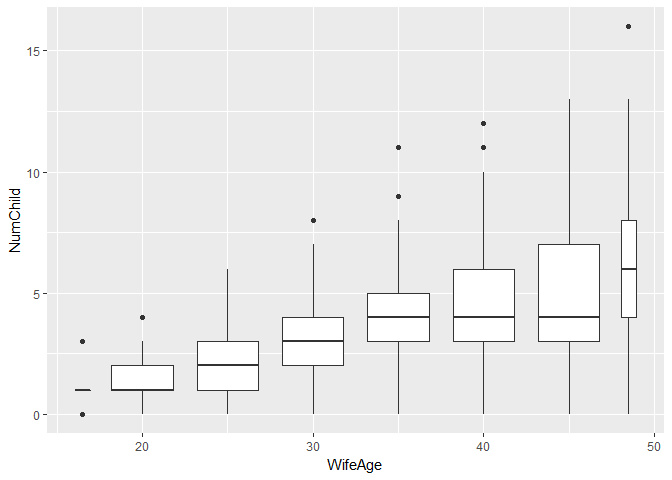
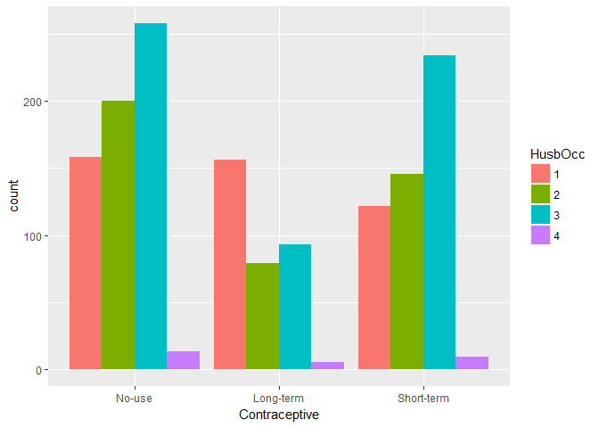
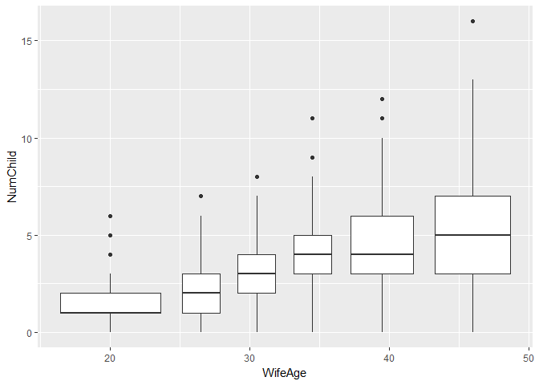
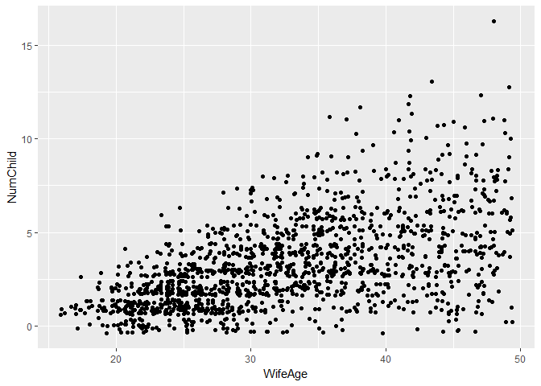
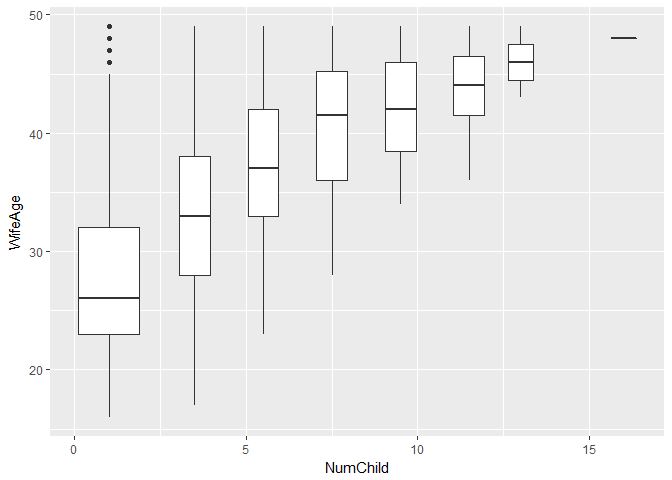
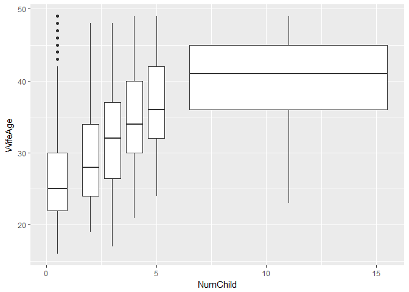
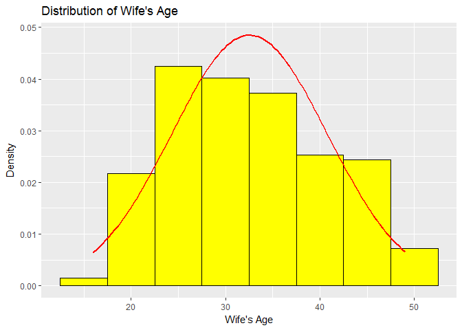

N741: Exploratory Data Analysis
================
Melinda K. Higgins, PhD.
January 30, 2017

Worked Example from the UCI Data Repository
-------------------------------------------

The following dataset comes from the [UCI Data Repository](http://archive.ics.uci.edu/ml/). The dataset we'll use is the Contraceptive Method Choice dataset. The information on this dataset is provided at <http://archive.ics.uci.edu/ml/datasets/Contraceptive+Method+Choice>. If you click on the "Data Folder" you can download the RAW data `cmc.data` which is a comma delimited format dataset (i.e. it is a CSV formatted file) and the description of the data included, the variable names and associated codes for the values included which is in the `cmc.names` file. See "Data Folder"" at <http://archive.ics.uci.edu/ml/machine-learning-databases/cmc/>

### Read-in data

**NOTE:** Download the 2 files from the UCI Data Repository for the Contraceptive Method Choice and put them in the directory where you have this RMD `rmarkdown` file.

``` r
# read in the comma delimited (CSV) formatted dataset
# **NOTE**: This dataset does NOT have the column
# names as the 1st row of the file. We will assign the 
# column names below.
cmc <- read_csv("cmc.data", col_names=FALSE)
```

    ## Parsed with column specification:
    ## cols(
    ##   X1 = col_integer(),
    ##   X2 = col_integer(),
    ##   X3 = col_integer(),
    ##   X4 = col_integer(),
    ##   X5 = col_integer(),
    ##   X6 = col_integer(),
    ##   X7 = col_integer(),
    ##   X8 = col_integer(),
    ##   X9 = col_integer(),
    ##   X10 = col_integer()
    ## )

### Apply the codebook - variable names and coding used

Apply variable names to the 10 columns of data in `cmc`.

``` r
# assign new variables names to the 10 columns
names(cmc) <- c("WifeAge", "WifeEd", "HusbEd", "NumChild",
                "WifeRel", "WifeWork", "HusbOcc", "SOLindex", 
                "Media", "Contraceptive")
```

The next code chunk is to add the labels for "factor" levels for some of the variables (i.e. we are creating factors).

**WARNING**: Notice I'm overwriting the variables and changing them from integers to factors which have different properties as you'll see below. If you want to keep the original integer variables, you could simply give the new facotr variable a new name. For example you could write

    cmc$WifeEd.f <- factor(cmc$WifeEd,
                           levels = c(1,2,3,4),
                           labels = c("low","med low","med

and this would append a new column onto the `cmc` dataset that is the "factor" type version of Wife's Education. For now, use the code below to update all of the variables.

``` r
# update Wife Education as a factor, assign the 
# levels and the labels for each level
cmc$WifeEd <- factor(cmc$WifeEd,
                     levels = c(1,2,3,4),
                     labels = c("low","med low","med high","high"))

# do the remaining variables
cmc$HusbEd <- factor(cmc$HusbEd,
                     levels = c(1,2,3,4),
                     labels = c("low","med low","med high","high"))

cmc$WifeRel <- factor(cmc$WifeRel,
                      levels = c(0,1),
                      labels = c("Non-Islam","Islam"))

# Note: The documentation does state that
# 0=yes and 1=no which seems incorrect...
cmc$WifeWork <- factor(cmc$WifeWork,
                       levels = c(0,1),
                       labels = c("Yes","No"))

cmc$HusbOcc <- factor(cmc$HusbOcc,
                      levels = c(1,2,3,4),
                      labels = c("1","2","3","4"))

cmc$SOLindex <- factor(cmc$SOLindex,
                       levels = c(1,2,3,4),
                       labels = c("low","med low","med high","high"))

cmc$Media <- factor(cmc$Media,
                    levels = c(0,1),
                    labels = c("Good","Not Good"))

cmc$Contraceptive <- factor(cmc$Contraceptive,
                            levels = c(1,2,3),
                            labels = c("No-use","Long-term","Short-term"))
```

### Look at a subset of the data

``` r
head(cmc)
```

    ## # A tibble: 6 × 10
    ##   WifeAge   WifeEd   HusbEd NumChild WifeRel WifeWork HusbOcc SOLindex
    ##     <int>   <fctr>   <fctr>    <int>  <fctr>   <fctr>  <fctr>   <fctr>
    ## 1      24  med low med high        3   Islam       No       2 med high
    ## 2      45      low med high       10   Islam       No       3     high
    ## 3      43  med low med high        7   Islam       No       3     high
    ## 4      42 med high  med low        9   Islam       No       3 med high
    ## 5      36 med high med high        8   Islam       No       3  med low
    ## 6      19     high     high        0   Islam       No       3 med high
    ## # ... with 2 more variables: Media <fctr>, Contraceptive <fctr>

### Print this subset using `knitr::kable()`

``` r
knitr::kable(head(cmc))
```

|  WifeAge| WifeEd   | HusbEd   |  NumChild| WifeRel | WifeWork | HusbOcc | SOLindex | Media | Contraceptive |
|--------:|:---------|:---------|---------:|:--------|:---------|:--------|:---------|:------|:--------------|
|       24| med low  | med high |         3| Islam   | No       | 2       | med high | Good  | No-use        |
|       45| low      | med high |        10| Islam   | No       | 3       | high     | Good  | No-use        |
|       43| med low  | med high |         7| Islam   | No       | 3       | high     | Good  | No-use        |
|       42| med high | med low  |         9| Islam   | No       | 3       | med high | Good  | No-use        |
|       36| med high | med high |         8| Islam   | No       | 3       | med low  | Good  | No-use        |
|       19| high     | high     |         0| Islam   | No       | 3       | med high | Good  | No-use        |

### Summarize the dataset

**NOTICE** that Wife's Age and Number of Children are now the only "numeric" "integer" variables - these are the only ones for which we get summary statistics. All the remaining variables are "factors" so we only get the frequencies for each category.

``` r
summary(cmc)
```

    ##     WifeAge           WifeEd         HusbEd       NumChild     
    ##  Min.   :16.00   low     :152   low     : 44   Min.   : 0.000  
    ##  1st Qu.:26.00   med low :334   med low :178   1st Qu.: 1.000  
    ##  Median :32.00   med high:410   med high:352   Median : 3.000  
    ##  Mean   :32.54   high    :577   high    :899   Mean   : 3.261  
    ##  3rd Qu.:39.00                                 3rd Qu.: 4.000  
    ##  Max.   :49.00                                 Max.   :16.000  
    ##       WifeRel     WifeWork   HusbOcc     SOLindex        Media     
    ##  Non-Islam: 220   Yes: 369   1:436   low     :129   Good    :1364  
    ##  Islam    :1253   No :1104   2:425   med low :229   Not Good: 109  
    ##                              3:585   med high:431                  
    ##                              4: 27   high    :684                  
    ##                                                                    
    ##                                                                    
    ##     Contraceptive
    ##  No-use    :629  
    ##  Long-term :333  
    ##  Short-term:511  
    ##                  
    ##                  
    ## 

### Computing stats on factors

Suppose you wanted to know the mean education level of the Huband's in this dataset. We can use the `as.numeric()` function to convert the variable and then run a `mean()` on it. We'll do more on facotrs later this semester.

``` r
mean(as.numeric(cmc$HusbEd))
```

    ## [1] 3.429735

### Cleaning up your tables & Improving Workflow with PIPES (`%>%`)

``` r
# these lines of code use the %>% "pipe" command.
# It also uses the group_by() function
# also in the dplyr package. The lines below can be read as
# "take the XXX (cmc) dataset, THEN summarise the
# sample size and sample mean.

# initial steps
cmc %>%
    summarise(nChild = length(NumChild),
              meanChild = mean(NumChild))
```

    ## # A tibble: 1 × 2
    ##   nChild meanChild
    ##    <int>     <dbl>
    ## 1   1473  3.261371

``` r
# look at output - figure out number of columns, add knitr::kable()
# put in good column names (2 columns) and a TITLE using caption
cmc %>%
    summarise(nChild = length(NumChild),
              meanChild = mean(NumChild)) %>%
  knitr::kable(col.names=c("N","mean"),
                 caption="Number of Children: Descriptive Stats")
```

|     N|      mean|
|-----:|---------:|
|  1473|  3.261371|

``` r
# let's add more descriptive stats to our table
# this means we now have more columns - one per stat
cmc %>%
    summarise(nChild = length(NumChild),
              minChild = min(NumChild),
              meanChild = mean(NumChild),
              sdChild = sd(NumChild),
              medianChild = median(NumChild),
              maxChild = max(NumChild)) %>%
    knitr::kable(col.names=c("N","min",
                             "mean","sd","median","max"),
                 caption="Number of Children: Descriptive Stats")
```

|     N|  min|      mean|        sd|  median|  max|
|-----:|----:|---------:|---------:|-------:|----:|
|  1473|    0|  3.261371|  2.358549|       3|   16|

``` r
# let's do again but BY Wife's Religion (2 groups)
# group the data BY
# each continent THEN summarise each continent's mean and sd."
# I THEN sent the output to the kable function to output
# there is one more column now for Wife's Religion.
cmc %>%
    group_by(WifeRel) %>%
    summarise(nChild = length(NumChild),
              minChild = min(NumChild),
              meanChild = mean(NumChild),
              sdChild = sd(NumChild),
              medianChild = median(NumChild),
              maxChild = max(NumChild)) %>%
    knitr::kable(col.names=c("Wife Religion","N","min",
                             "mean","sd","median","max"),
                 digits = 2,
                 caption="Number of Children: Stats by Wife Religion")
```

| Wife Religion |     N|  min|  mean|    sd|  median|  max|
|:--------------|-----:|----:|-----:|-----:|-------:|----:|
| Non-Islam     |   220|    0|  2.85|  1.80|       3|   11|
| Islam         |  1253|    0|  3.33|  2.44|       3|   16|

### Using and Getting R Code from `Rcmdr` package (with GUI interface)

OUTSIDE of the RMD file - run `library(Rcmdr)`. We'll load the `cmc` dataset into the local environment. Then use the GUI in `Rcmdr` to generate the R code for what you might want.

For example, getting the counts and relative %s for Wife Working categories.

``` r
local({
  .Table <- with(cmc, table(WifeWork))
  cat("\ncounts:\n")
  print(.Table)
  cat("\npercentages:\n")
  print(round(100*.Table/sum(.Table), 2))
})
```

    ## 
    ## counts:
    ## WifeWork
    ##  Yes   No 
    ##  369 1104 
    ## 
    ## percentages:
    ## WifeWork
    ##   Yes    No 
    ## 25.05 74.95

``` r
Table <- with(cmc, table(WifeWork))
knitr::kable(as.data.frame(Table))
```

| WifeWork |  Freq|
|:---------|-----:|
| Yes      |   369|
| No       |  1104|

two-way table % chi-square test
===============================

Open `Rcmdr` and run a two-way table with a Chi-square test of independence between Husband Occupation and Contraceptive use. And run the Rmarkdown - Generate Report from within Rcmdr to see how that report is set-up.

``` r
# r packages Rcmdr Rmarkdown uses - you'll need these too
library(Rcmdr)
```

    ## Loading required package: splines

    ## Loading required package: RcmdrMisc

    ## Loading required package: car

    ## 
    ## Attaching package: 'car'

    ## The following object is masked from 'package:dplyr':
    ## 
    ##     recode

    ## The following object is masked from 'package:purrr':
    ## 
    ##     some

    ## Loading required package: sandwich

    ## The Commander GUI is launched only in interactive sessions

``` r
library(car)
library(RcmdrMisc)
library(rgl)
```

### capture R code chunks for the two-way table and chi-square stats

``` r
library(abind, pos=23)
```

``` r
# the following is the code generated by Rcmdr
local({
  .Table <- xtabs(~HusbOcc+Contraceptive, data=cmc)
  cat("\nFrequency table:\n")
  print(.Table)
  cat("\nRow percentages:\n")
  print(rowPercents(.Table))
  .Test <- chisq.test(.Table, correct=FALSE)
  print(.Test)
})
```

    ## 
    ## Frequency table:
    ##        Contraceptive
    ## HusbOcc No-use Long-term Short-term
    ##       1    158       156        122
    ##       2    200        79        146
    ##       3    258        93        234
    ##       4     13         5          9
    ## 
    ## Row percentages:
    ##        Contraceptive
    ## HusbOcc No-use Long-term Short-term Total Count
    ##       1   36.2      35.8       28.0 100.0   436
    ##       2   47.1      18.6       34.4 100.1   425
    ##       3   44.1      15.9       40.0 100.0   585
    ##       4   48.1      18.5       33.3  99.9    27
    ## 
    ##  Pearson's Chi-squared test
    ## 
    ## data:  .Table
    ## X-squared = 65.401, df = 6, p-value = 3.573e-12

Let's pull out the code pieces we need and use `knitr` to make a better table.

``` r
# create a Table object for the results from xtabs()
Table <- xtabs(~HusbOcc+Contraceptive, data=cmc)

# use the rowPercents (from the RcmdrMisc package)
# to pull these out of the Table
# make it a data.frame and make a nice table with knitr
knitr::kable(as.data.frame(rowPercents(Table)),
             caption = "Contraceptive Use by Husband Occupation")
```

|  No-use|  Long-term|  Short-term|  Total|  Count|
|-------:|----------:|-----------:|------:|------:|
|    36.2|       35.8|        28.0|  100.0|    436|
|    47.1|       18.6|        34.4|  100.1|    425|
|    44.1|       15.9|        40.0|  100.0|    585|
|    48.1|       18.5|        33.3|   99.9|     27|

### Chi-square test results

``` r
# and run the chi-square test and show the results
chisq.test(Table, correct=FALSE)
```

    ## 
    ##  Pearson's Chi-squared test
    ## 
    ## data:  Table
    ## X-squared = 65.401, df = 6, p-value = 3.573e-12

### Make Plots with `Rcmdr`

Clustered Bar plot - side-by-side - Contraceptive Use by Husband Occupation

``` r
with(cmc, Barplot(Contraceptive, by=HusbOcc, style="parallel", 
  legend.pos="topright", xlab="Contraceptive", ylab="Frequency"))
```



### Make a Clustered Bar plot with `ggplot2`

using the "dodge" option

``` r
ggplot(cmc, aes(x=Contraceptive, fill=HusbOcc)) + 
  geom_bar(position='dodge')
```



using the "stack" option

``` r
ggplot(cmc, aes(x=Contraceptive, fill=HusbOcc)) + 
  geom_bar(position='stack')
```



using the "fill" option

``` r
ggplot(cmc, aes(x=Contraceptive, fill=HusbOcc)) + 
  geom_bar(position='fill')
```


### Scatterplot of Wife's Age and Number of Children

Remember there are 1473 subjects in this dataset.

``` r
cmc %>%
  ggplot(aes(x=WifeAge, y=NumChild)) +
    geom_point()
```


This obviously has a lot of overplotting (points on top of one another). One way to alleviate this issue is to add "jitter" or a little bit of randomness so the points won't lie on top of one another.

``` r
cmc %>%
  ggplot(aes(x=WifeAge, y=NumChild)) +
    geom_point(position = "jitter")
```



Still another way to "bin" the data in 2 dimensions with a lot of points in a scatterplot is to use the `geom_hex()` function which basically does a density plot using 2-D bins like a 2-D histogram in a way.

``` r
cmc %>%
  ggplot(aes(x=WifeAge, y=NumChild)) +
    geom_hex()
```


### Boxplot options

``` r
# make a boxplot showing the range of Wife Ages by
# Number of Children - "bin" widths = 1 child
# we'll use cut_width
cmc %>%
  ggplot(aes(x=NumChild, y=WifeAge)) +
    geom_boxplot(aes(group=cut_width(NumChild, 1)))
```


``` r
# we could also use a binning option based
# on n groups of equal Number of Children range
# let's try 8 intervals using cut_interval
cmc %>%
  ggplot(aes(x=NumChild, y=WifeAge)) +
    geom_boxplot(aes(group=cut_interval(NumChild, 8)))
```



``` r
# this time use cut_number and 6 bins
# so that each bin has about the same # of cases
cmc %>%
  ggplot(aes(x=NumChild, y=WifeAge)) +
    geom_boxplot(aes(group=cut_number(NumChild, 6)))
```



### Histograms and Density estimates of Continuous Data

Let's look at Wife's Age and Number of Children - do you expect these to look normal?

see more at <http://www.cookbook-r.com/Graphs/Plotting_distributions_(ggplot2)/>

``` r
cmc %>%
  ggplot(aes(WifeAge)) +
    geom_histogram(aes(y=..density..),
                   colour="black",fill="white",
                   binwidth=5) +
    geom_density()
```



``` r
cmc %>%
  ggplot(aes(WifeAge)) +
    geom_histogram(aes(y=..density..),
                   colour="black",fill="yellow",
                   binwidth=5) +
    geom_density(alpha=.2, fill="blue")
```


What about overlaying a Normal Curve? Also add some better axis labels and a title

``` r
cmc %>%
  ggplot(aes(WifeAge)) +
    geom_histogram(aes(y=..density..),
                   colour="black",fill="yellow",
                   binwidth=5) + 
    stat_function(fun = dnorm, 
                  args = list(mean = mean(cmc$WifeAge), 
                              sd = sd(cmc$WifeAge)), 
                  lwd = 1, 
                  col = 'red') +
  labs(title = "Distribution of Wife's Age",
       x = "Wife's Age",
       y = "Density")
```


